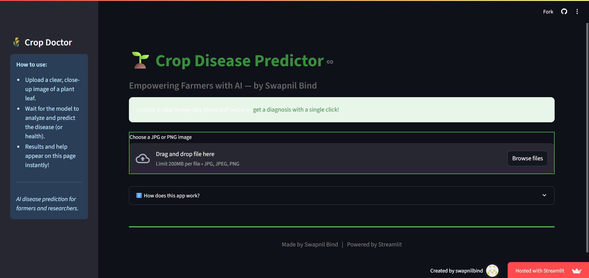

# 🌿 Crop Doctor – Plant Disease Detection with AI

Diagnose crop diseases from leaf images using a state-of-the-art Vision Transformer model, built with PyTorch and Streamlit.

---

🌱 **Try the app live:**  
[https://crop-doctor-app.streamlit.app/](https://crop-doctor-app.streamlit.app/)

---

## 🚀 Features

- **Upload plant leaf images** and receive instant prediction of disease type or healthy status.
- **Vision Transformer (ViT) AI** model trained on 38 crop disease and healthy categories.
- **User-friendly interface** with sidebar instructions, attractive layout, and visual feedback.
- **Runs locally or on Streamlit Cloud** – no user images are stored.

---

## 📈 Model Performance

| Metric                | Value   |
|-----------------------|---------|
| **Validation Accuracy** | 99.32%  |
| **Test Accuracy**      | 99.29%  |

---

## 🖼️ Demo Screenshot

---

## 📁 Project Structure
crop-doctor-app/
│
├── app.py # Main Streamlit app
├── vit_plantdisease.pt # Trained PyTorch ViT model (via Git LFS)
├── classes.txt # Plant disease class labels
├── requirements.txt # Python dependencies
├── new-crop.ipynb # Data/model exploration notebook

---

## 🚦 How To Use

### 1. Run Locally

1. **Clone this repo:**
git clone https://github.com/swapnilbind/crop-doctor-app.git
cd crop-doctor-app

2. **(If model file missing)**  
Download `vit_plantdisease.pt` and place it here.

3. **Install dependencies:**
pip install -r requirements.txt

4. **Launch the app:**
streamlit run app.py
Then open the provided URL in your browser.

### 2. Use Online (No Installation Required)

- **Go to:** [https://crop-doctor-app.streamlit.app/](https://crop-doctor-app.streamlit.app/)

---

## 🛠️ Technical Details

- **Model:** PyTorch Vision Transformer (vit_b_16)
- **Frontend:** Streamlit
- **Classes:** 38 common plant diseases and healthy categories (see `classes.txt`)
- **Input:** JPG or PNG leaf photographs, ideally sharp and close-up.

---

## 📝 Instructions

1. Upload a *clear image* of a crop leaf using the file uploader.
2. Wait for the AI model to process the image.
3. View the result: predicted disease or "healthy".
4. For unhealthy predictions, seek expert advice for treatment.

---

## 📄 License

Project for research and educational purposes.

---

## 🙏 Credits

- Developed by **Swapnil Bind**
- Powered by Streamlit, PyTorch, and open agricultural datasets.

---

**Deploy your own:**  
Fork or clone this repo, retrain with your data, and redeploy on [Streamlit Cloud](https://streamlit.io/cloud).

---

